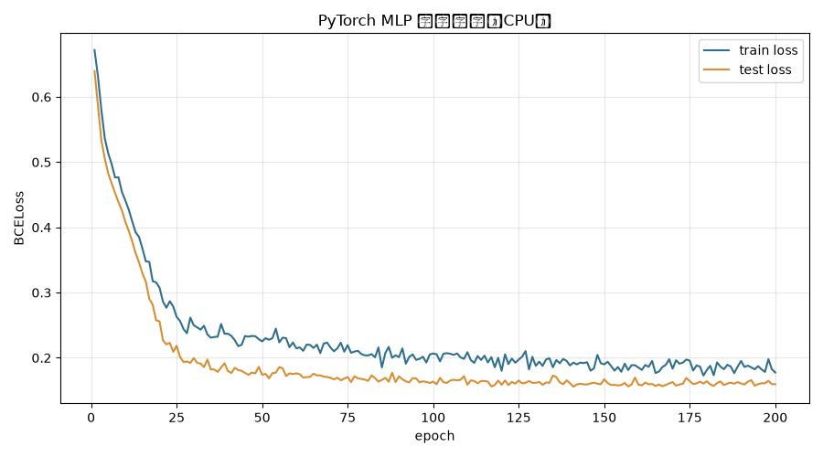
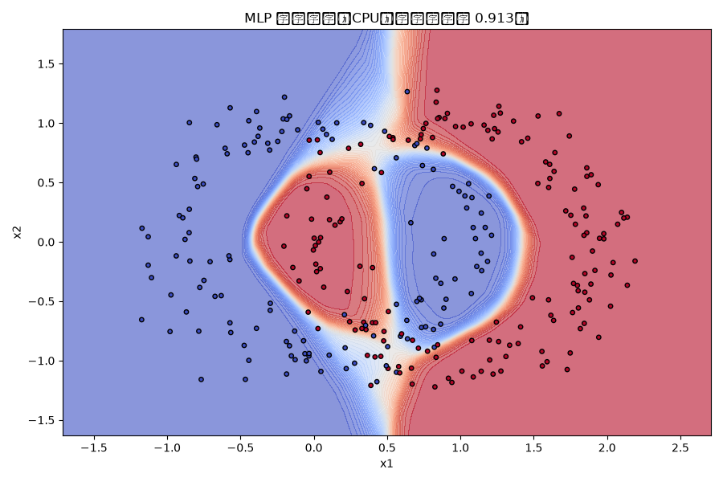

# PyTorch CPU 云端训练报告

- **PyTorch**: 2.13.0+cpu (CPU)
- **CUDA**: False（应为 False，纯 CPU 训练）
- **CPU 核数**: 4
- **模型**: 3 隐层 MLP（每层 64 神经元 + Dropout），参数量 **8,577**
- **数据**: 双月(moons)合成二分类，1500 样本（80/20 切分）
- **训练**: 200 epochs × batch 128，耗时 **2.33s**
- **最终测试准确率**: **0.9133**

## 训练曲线

## 决策边界

## 每 50 epoch 指标

| epoch | train_loss | test_loss | test_acc |
|---|---|---|---|
| 1 | 0.6718 | 0.6397 | 0.7667 |
| 51 | 0.2302 | 0.1754 | 0.9133 |
| 101 | 0.2055 | 0.1594 | 0.92 |
| 151 | 0.1939 | 0.1613 | 0.91 |

---
> 原始数据见 `time_result.json`（含全部 200 个 epoch 的曲线）。